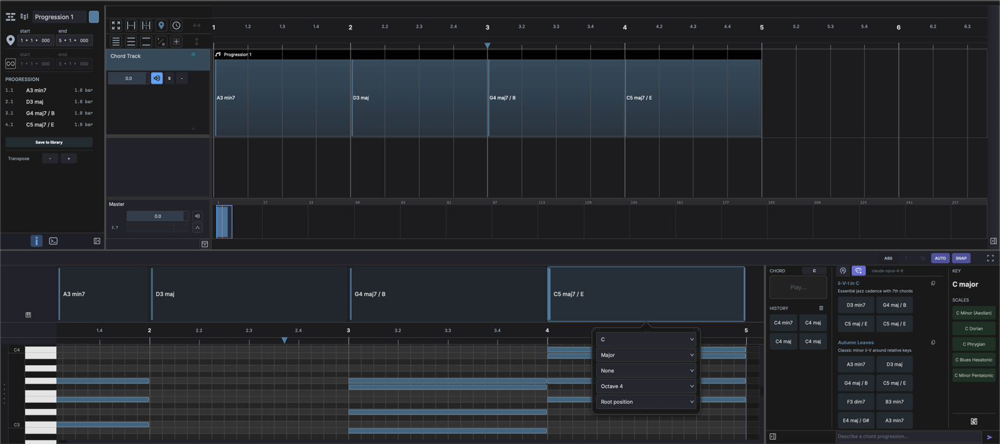

# Chord Track

The Chord Track lays out a chord progression that guides the harmony of your song. You sketch the progression as a row of named chord blocks — *A min7*, *D maj*, *G maj7 / B* — and each block carries the actual MIDI voicing underneath, which you can audition and refine.

A project has a single chord track. Once you have added it, the menu item that creates it is disabled.

## Creating a Chord Track

Choose **Track → Add Chord Track**. The track appears with a simplified header:

- A **volume** control and a **solo** button.
- A **chord audition** toggle (the speaker icon) that controls whether the progression sounds during playback.

It has no mute button or level meter — the chord track is a guide, not an audio output.

## Editing Chords

The chord track's clip opens in a dedicated chord editor at the bottom of the window. The top **chord lane** holds the chord blocks; a piano-roll strip below shows the voiced notes for the selected chord.

- **Add** — click an empty spot on the chord lane to drop a chord at the nearest bar.
- **Edit** — double-click a block to open the chord popup, with dropdowns for:
    - **Root** — C through B
    - **Quality** — Major, Minor, Dim, Aug, Sus2, Sus4, 5 (power), Dom
    - **Extension** — None, add2/add4, 6, 7, 9, … (the choices depend on the quality)
    - **Octave**
    - **Inversion** — Root position, 1st, 2nd, 3rd
- **Move / resize** — drag a block along the lane to move it, or drag its edges to change its length. Hold ++alt++ while dragging to copy a chord.
- **Audition** — click a block to hear it through the track's instrument.
- **Delete** — select a block and press ++delete++.

You can also drag a chord straight from the [Chord Engine](devices/chord-engine.md) suggestion grid onto the chord lane.

## The Progression List

Select the chord clip and open the **Inspector** to see the **Progression** list — every chord with its bar.beat position, name, and length:

| Pos | Chord | Length |
|----|----|----|
| 1.1 | A3 min7 | 1.0 bar |
| 2.1 | D3 maj | 1.0 bar |
| 3.1 | G4 maj7 / B | 1.0 bar |
| 4.1 | C5 maj7 / E | 1.0 bar |

- **Transpose** — the **-** / **+** buttons shift the whole progression up or down.
- **Save to library** — stores the progression in the chord progression library (see below).

## Chord Progression Library

Saved progressions live in the media library so you can reuse them across projects. Open the [Media Explorer](panels/browsers.md), switch it to **Library** (the database icon), and click the **chord progression** filter to list only progressions. Browse or filter them, then drag one onto a chord track to drop the whole progression in.
