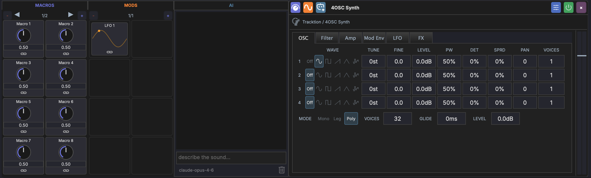

# 4OSC Synth

The 4OSC Synth is a four-oscillator subtractive synthesizer provided by the Tracktion Engine. It offers a full synthesis signal path with oscillators, filters, envelopes, LFOs, effects, and an internal modulation matrix.

## Overview

The 4OSC interface is organized into six tabs:

| Tab | Content |
|-----|---------|
| **OSC** | Four oscillators with wave shape, tuning, level, pulse width, detune, spread, pan, and unison voices |
| **Filter** | Multimode filter with cutoff, resonance, key tracking, velocity, and a dedicated filter envelope |
| **Amp** | Amplitude envelope (ADSR) with velocity sensitivity and analog mode |
| **Mod Env** | Two modulation envelopes with ADSR controls and mod destination assignments |
| **LFO** | Two LFOs with wave shape, rate, depth, tempo sync, and mod destination assignments |
| **FX** | Built-in distortion, reverb, delay, and chorus effects |

## OSC Tab

Each of the four oscillators has:

| Parameter | Description |
|-----------|-------------|
| **Wave Shape** | Sine, triangle, square, sawtooth, pulse, noise |
| **Tune** | Coarse tuning in semitones |
| **Fine** | Fine tuning in cents |
| **Level** | Oscillator volume in dB |
| **Pulse Width** | Pulse width for pulse/square waves |
| **Detune** | Unison detune amount |
| **Spread** | Stereo spread of unison voices |
| **Pan** | Stereo position |
| **Voices** | Number of unison voices |

Below the oscillators are global controls:

| Parameter | Description |
|-----------|-------------|
| **Mode** | Mono, Legato, or Poly voice mode |
| **Voices** | Maximum polyphony (poly mode) |
| **Legato** | Legato glide time |
| **Master Level** | Master output level in dB |

## Filter Tab

A multimode filter with its own envelope:

- **Type** — Low-pass, high-pass, band-pass, notch
- **Slope** — 12 dB or 24 dB per octave
- **Freq** — Cutoff frequency
- **Resonance** — Filter resonance
- **Key Track** — How much the cutoff follows the note pitch
- **Velocity** — How much velocity affects the cutoff
- **Amount** — Filter envelope depth

The filter envelope has independent Attack, Decay, Sustain, and Release controls.

## Amp Tab

The amplitude envelope shapes the volume of each note:

- **Attack, Decay, Sustain, Release** — Standard ADSR
- **Velocity** — How much velocity affects the volume
- **Analog** — Adds subtle per-voice variation for an analog feel

## Mod Env Tab

Two modulation envelopes (Env 1 and Env 2) that can be routed to any synth parameter via the internal mod matrix. Each has Attack, Decay, Sustain, and Release controls.

### Assigning Mod Envelope Destinations

Below the envelope controls, use the **+ Env 1** and **+ Env 2** buttons to assign a modulation destination:

1. Click **+ Env 1** (or **+ Env 2**)
2. Select the destination parameter from the dropdown
3. Click **Add**
4. Drag the depth slider to set the modulation amount (-100% to +100%)
5. Click **X** to remove an assignment

## LFO Tab

Two LFOs with independent controls:

| Parameter | Description |
|-----------|-------------|
| **Wave** | Sine, triangle, square, sawtooth, sample & hold, noise |
| **Rate** | LFO speed |
| **Depth** | LFO intensity |
| **Sync** | Lock rate to project tempo |

### Assigning LFO Destinations

Below the LFO controls, use the **+ LFO 1** and **+ LFO 2** buttons to assign modulation destinations. The workflow is the same as for mod envelopes:

1. Click **+ LFO 1** (or **+ LFO 2**)
2. Select the destination parameter from the dropdown
3. Click **Add**
4. Drag the depth slider to set the modulation amount (-100% to +100%)
5. Click **X** to remove an assignment

Each assignment appears as a row showing the source and destination (e.g. "LFO 1 > Filter Freq") with a depth slider.

## FX Tab

Built-in effects that can be toggled on or off independently:

| Effect | Parameters |
|--------|------------|
| **Distortion** | Amount |
| **Reverb** | Size, Damping, Width, Mix |
| **Delay** | Feedback, Crossfeed, Mix |
| **Chorus** | Speed, Depth, Width, Mix |

## Internal Modulation vs Track Modulators

The 4OSC's internal mod matrix (LFO and Mod Env assignments) operates inside the synth's audio processing. This is separate from MAGDA's track-level [modulators](../modulation/overview.md), which are external LFOs and curves that can target any device parameter on the track.

Both systems can be used simultaneously — for example, you might use the 4OSC's internal LFO 1 for filter wobble while using a track-level LFO for panning.

## AI Sound Design (`/design`) {#ai-sound-design-design}

The [AI Assistant](../panels/ai-assistant.md) panel includes a `/design` slash command that generates a 4OSC preset from a natural-language description. Focus a 4OSC device, type `/design <description>` in the chat, and the assistant fills in the wave shapes, filter type, voice mode, FX gates, ADSR envelopes, and parameter values directly on the device.

The result is a **starting point** — the AI is consistent within musical genres but won't replace tweaking by ear. Once you're happy, click the device header's save button. The dialog auto-fills the preset name and category the AI chose, so saving is just two clicks.

### Quick usage

Run `/design --help` in the AI chat for an in-app cheat sheet with example prompts.

### Design Recipes

These prompts are tuned for the AI agent's vocabulary. They produce reliable results — adjust the wording slightly to nudge the sound in different directions.

#### Bass

| Prompt | Result |
|--------|--------|
| `/design deep sub bass` | Pure sine sub with snappy envelope, mono voicing |
| `/design fat reese bass with movement` | Detuned saws + slow filter / LFO movement |
| `/design acid bass with resonant filter` | Square + saw with resonant low-pass, mono with envelope mod |
| `/design 808-style bass with sub and click` | Sine sub plus short attack click, decay envelope |
| `/design dub-style bass with delay` | Filtered saw, mono voicing, delay FX gate on |

#### Lead

| Prompt | Result |
|--------|--------|
| `/design fat detuned saw lead with octave layer` | Two detuned saws + octave-up square, legato voicing |
| `/design trance supersaw lead` | Multiple detuned saws, wide stereo, polyphonic |
| `/design bright square lead with chorus` | Square wave with PWM, chorus FX engaged |
| `/design legato mono synth lead with portamento` | Mono legato voicing with `legato` parameter set |
| `/design screaming acid lead` | Saw + square, high resonance, distortion gate on |

#### Pad

| Prompt | Result |
|--------|--------|
| `/design warm analog pad` | Detuned saws, slow attack/release, gentle filter envelope |
| `/design evolving ambient pad with slow filter` | Long ADSR, LFO on filter cutoff, reverb gate on |
| `/design string ensemble pad` | Multiple saws with detune, slow attack, polyphonic |
| `/design dark cinematic drone` | Long release, low filter, reverb gate on |
| `/design lush chord pad` | Polyphonic, chorus gate on, medium attack |

#### Pluck

| Prompt | Result |
|--------|--------|
| `/design snappy saw pluck` | Saw with zero attack, short decay, low sustain |
| `/design muted soft pluck for arpeggios` | Triangle/sine with rolled-off filter, short envelope |
| `/design FM-style bell pluck` | Sine + sine with detune, short envelope |

#### Keys / Other

| Prompt | Result |
|--------|--------|
| `/design electric piano with chorus` | Sine fundamentals, chorus gate on, medium decay |
| `/design rising white noise sweep` | Noise oscillator, filter envelope sweeping up |
| `/design impact hit with reverb tail` | Short snap with reverb gate engaged |

### Tips

- **Focus the device first.** `/design` writes to whichever 4OSC device is selected. Without a focused device the chat shows the preset only.
- **Use a single sentence.** "Aggressive distorted reese bass with movement" works better than a multi-sentence brief.
- **Mention specific FX.** Saying "with reverb" / "with delay" / "with chorus" / "with distortion" engages the matching FX gate. Without these words the FX blocks stay bypassed even if their values are set.
- **Mention voicing.** "Mono lead", "legato bass", "polyphonic pad" — the AI honours these.
- **Mention root.** Octaves, fifths, and thirds work; the AI keeps at least one oscillator at the root unless you ask for a chord stack.
- **Iterate.** If a result is too dark, run `/design <same prompt> brighter`. The AI re-rolls from scratch each time, but the prompt vocabulary is consistent enough that small wording changes nudge the sound in predictable directions.
- **Save with category.** The save dialog has a Category field; the AI fills it (e.g. `Bass / Deep Sub`) so your bank stays organised.
