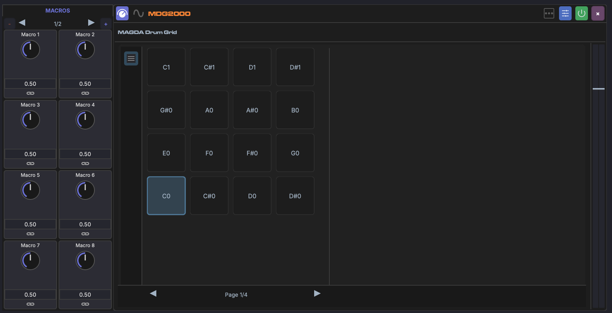

# Drum Grid

The Drum Grid is MAGDA's chain-based drum machine. Each pad is a full audio chain, giving you independent processing per drum voice.

## Overview

The Drum Grid maps incoming MIDI notes to individual pads. Each pad has its own sample, FX chain, and mixer controls, making it a self-contained drum kit in a single device.

## Pads

- Each pad is mapped to a specific MIDI note
- Pads can be triggered from the Piano Roll, the Drum Grid Editor (bottom panel), or a MIDI controller
- Click a pad to select it and view its chain in the Inspector

Pad **labels**, instrument **roles**, and **drumkits** are managed by right-clicking rows in the [Drum Grid Editor](../panels/drum-grid-editor.md#row-labels-and-roles).

## Per-Pad FX Chain

Each pad has its own FX chain, just like a regular track. You can add plugins, built-in devices, or racks to any pad's chain. This allows effects like distortion on a snare without affecting the kick.

## Per-Pad Mix

Each pad has independent mix controls:

- **Volume** — Pad output level
- **Pan** — Stereo position
- **Output routing** — Route individual pads to separate mixer channels for independent mixing

When a DrumGrid track is expanded in the [Mixer View](../mixer-view.md), each pad appears as its own sub-channel strip.

## Adding Samples

- Drag audio files from the Media Explorer onto a pad to load a sample
- Each pad plays one sample at a time

### Multi-Sample Drop

Select several samples in the [Media Explorer](../panels/browsers.md) or [Media Library](../panels/media-library.md) and drag them onto any pad. Samples fill consecutive pads in selection order, starting from the drop target. While dragging, every pad that will receive a sample lights up so you can see the range before releasing.

## Pad Envelope and Macros

Each pad plays its sample through MAGDA's sampler, which has an amplitude envelope you can shape per pad:

- **Attack** (ATK), **Decay** (DEC), **Sustain** (SUS), **Release** (REL)

These ADSR controls are full modulation targets. You can link them to the Drum Grid's [macros](../modulation/macros.md) and modulate them with LFOs or envelopes the same way as any other parameter (see [Linking Parameters](../modulation/linking.md)). Slicing a sample across several pads gives each slice its own envelope, so a single macro can, for example, tighten every slice's release at once.

## MIDI Mapping

The default mapping assigns pads to General MIDI drum note numbers (kick = C1, snare = D1, etc.), but pads can be remapped to any MIDI note.
