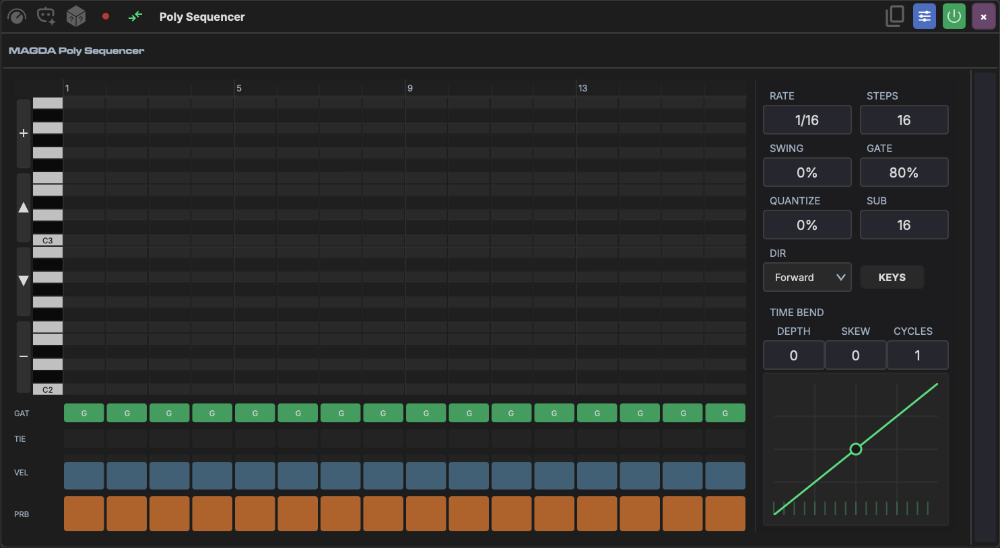

# Poly Sequencer

The Poly Sequencer is a polyphonic step-sequencer MIDI device. Where the [Step Sequencer](step-sequencer.md) plays one note per step, the Poly Sequencer can place a full chord — up to eight notes — on each step, and it switches between a melodic keyboard grid and a drum-lane grid.

## Top Controls

| Control | Range | Description |
|--------|-------|-------------|
| **Rate** | 1/4. to 1/32 (with dotted and triplet values) | How fast the sequencer advances |
| **Steps** | 1–32 | Number of active steps in the pattern |
| **Dir** | Forward, Reverse, Ping-Pong, Random | Playback direction |
| **Swing** | 0–100% | Offsets every other step for a shuffle feel |
| **Gate** | 5–100% | Default note length as a percentage of the step |
| **Quantize** | 0–100% | How strongly incoming MIDI is snapped to the grid |
| **Sub** | 16–512 | Grid resolution used by Quantize |

To the right of these sit the **KEYS / DRUM** view toggle and a **MIDI thru** button that passes incoming notes through to the downstream instrument.

## Pattern Views

The view toggle swaps the main grid between two modes.

### KEYS mode

A piano-roll grid: rows are pitches (with a keyboard on the left), columns are steps. Click a cell to add or remove a note at that pitch and step — stack several in one column to build a chord. Use the up/down arrows on the left margin to shift the visible octave range, or the mouse wheel to nudge it.

### DRUM mode

An x0x-style lane grid, one lane per drum sound. If a [Drum Grid](drum-grid.md) device sits downstream on the same track, the Poly Sequencer reads its pads and names the lanes to match; otherwise it falls back to a General MIDI drum map (Kick, Snare, Hi-Hat, and so on). Notes that don't match a lane appear as orphan lanes you can still edit.

Right-click any step in either mode for **Mute / Unmute Step**, **Clear Step**, and a **Pattern** submenu (shift by a semitone or octave, clear the pattern).

## Per-Step Lanes

Below the grid, four lanes set values for every step:

- **GAT** — toggle the step's gate on or off.
- **TIE** — tie the step to the previous one so the note sustains without retriggering.
- **VEL** — drag to set step velocity.
- **PRB** — drag to set the probability that the step fires, for humanised or evolving patterns.

## Time Bend

The **Time Bend** curve reshapes step timing across the pattern, the same idea as in the [Step Sequencer](step-sequencer.md) and [Arpeggiator](arpeggiator.md):

- **Depth** (-1 to 1) — curve intensity; positive front-loads steps, negative back-loads them.
- **Skew** (-1 to 1) — moves the curve's inflection point.
- **Cycles** — how many times the curve repeats within the pattern.

Right-click the curve's control point to switch it between a smooth and a hard (piecewise) shape.

## AI Pattern Generation

Describe the pattern you want — "4-on-the-floor kick", "lo-fi seventh chords", "hi-hat rolls" — and let the device's agent fill the grid. The agent reads the current mode and, in DRUM mode, the downstream drum lanes, so generated drum hits land on the right pads. Fields you leave alone in the request are preserved, so you can regenerate just the notes without losing your rate or step count.
