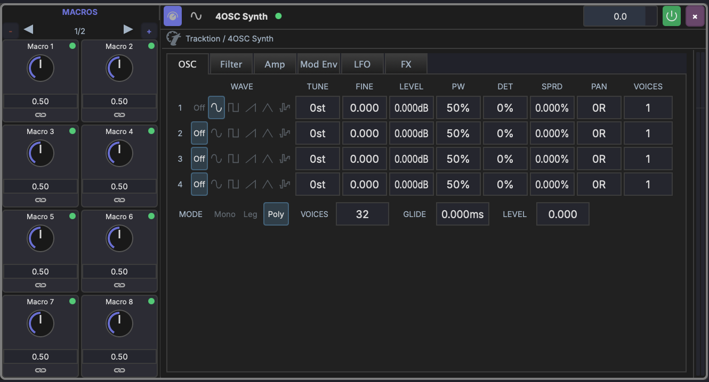
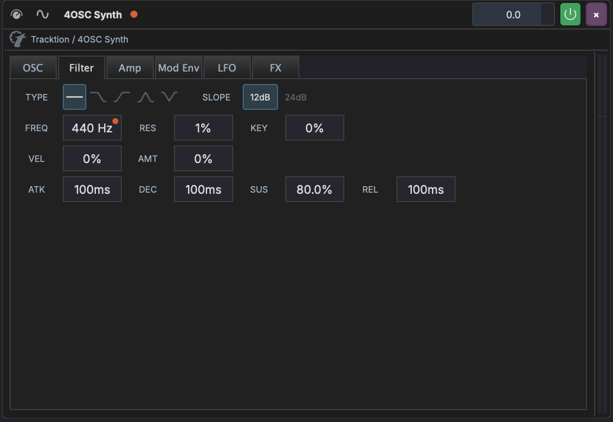
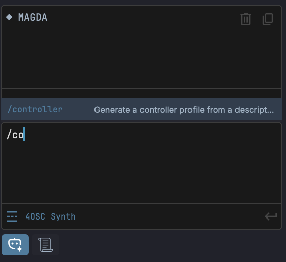

# Controllers

MAGDA can be driven by any class-compliant MIDI controller. Hardware knobs, sliders, pads, and pitch/mod wheels can all map to plugin parameters, macros, and LFO rates — with three complementary mapping systems:

- **Automap profiles** — a controller-specific profile maps each control to a focused-device macro automatically. Plug in a supported keyboard, focus a device, and the eight macro knobs already drive that device's macros. No setup.
- **MIDI Learn** — right-click any parameter, macro, or LFO Rate, choose **Learn MIDI**, move a controller, done. The mapping is yours and persists with the project.
- **Lua scripts** — for controllers that need behaviour profiles can't express (DAW protocols like Mackie Control, motorised feedback, mode switching), load a `.lua` script that handles raw MIDI directly. See [Lua Controller Scripts](#lua-controller-scripts) below.

Profile and Learn'd bindings can coexist — a Learn'd binding shadows automap on the same CC so your custom mapping wins. A loaded Lua script takes the input layer entirely; it owns the controller for as long as it's active.

## Controllers Dialog

Open from **Settings > Controllers**. The dialog has two tabs:

- **Profiles** — registered hardware controllers with their assigned MIDI input ports
- **Scripts** — `.lua` controller scripts (see [Lua Controller Scripts](#lua-controller-scripts))

### Profiles tab

One row per registered controller. Each row shows:

| Column | Description |
|---|---|
| **Status dot** | Green when the assigned MIDI input is currently connected, dim when it isn't |
| **Name** | Manufacturer + model |
| **Input port** | The live MIDI input the controller is bound to |

Two buttons sit in the header:

- **+ Add profile** — register a new controller using one of the profiles already in your [controllers directory](#profiles-directory). Pops a menu of available profiles, then asks which MIDI input the controller is connected to.
- **Upload profile…** — pick a `.json` profile from disk and import it. Validates the JSON, copies it into the controllers directory, and refreshes the registry. After upload, the new profile is available to **+ Add profile**.

Right-click a row to **Show profile in Finder** (reveals the JSON file) or **Remove** (deletes the controller and its bindings).

Bindings created by MIDI Learn against a removed controller's port still work — they attach to the live MIDI port name, not to the controller registry entry.

### Profiles

A profile describes a controller's physical layout — which CC numbers correspond to the eight macro knobs, and so on. MAGDA ships with profiles for common controllers (Launchkey Mini MK3 / MK4, generic 8-knob, etc.) and you can add your own.

When a profile is assigned to a controller and a device is focused, the profile's macro knobs drive **that device's macros**. Focus a different device — the same hardware knobs follow.

If you only want MIDI Learn (no automap), don't add a controller — Learn'd bindings route via the live port name and don't need a registry entry.

#### Profiles directory

User profiles live alongside MAGDA's other configuration:

| Platform | Path |
|---|---|
| macOS | `~/Library/MAGDA/controllers/` |
| Windows | `%APPDATA%\MAGDA\controllers\` |
| Linux | `~/.config/MAGDA/controllers/` |

On first launch the bundled profiles are seeded into this folder. Edits and additions there are durable — drop a new `*.json` profile in and it's available next time you open the Controllers dialog.

### Profile JSON format

For the full JSON schema, the resolver list (the functions that route a CC to a target — `focused.macro`, `selected.volume`, `master.pan`, etc.), the `<vendor>.<model>.<intent>` id convention, and a worked example, see the [Controller Profile Format reference](../reference/controller-profile-format.md).

## MIDI Learn

To map a single hardware control to a single MAGDA target:

1. Right-click the parameter, macro knob, or LFO **Rate** slider.
2. Choose **Learn MIDI**. The control pulses orange.
3. Move a knob, slider, or press a button on your controller.
4. The binding is captured. The pulse stops; an orange dot appears.

Learn works on:

- **Plugin parameters** — any device parameter (pulses on the slider).
- **Macros** — track, rack, or device macros. Right-click the knob.
- **LFO / modifier Rate** — right-click the **Rate** slider in the modulator editor.

To cancel without capturing, choose **Cancel MIDI Learn** (same menu, same item).

## Clearing Mappings

Right-click → **Clear MIDI Mapping (N)** removes only your Learn'd bindings; automap profile coverage is left alone. After clearing a Learn'd macro, the macro falls back to its profile mapping (the dot returns to green).

## Indicator Legend

MAGDA shows controller coverage as small dots on macro knobs, parameter slots, and device headers.

| Dot | Meaning |
|-----|---------|
| Green | Profile-driven (automap) binding is active on this target. |
| Orange | A user MIDI Learn'd binding is active. |
| Grey | Profile binding exists but is shadowed by an explicit Learn override on the same CC. |

A device header can show two dots side-by-side (green for profile coverage, orange for any Learn'd binding inside the device).



*Above: a 4OSC Synth focused with an automap-mapped controller. Each macro knob carries a green dot — the automap profile is driving them, and the device-header dot mirrors the same green.*



*Above: the FREQ slider has an orange dot — a user MIDI Learn binding is in effect. The device-header dot turns orange to mirror it.*

## Generating a Profile from Description

If MAGDA doesn't ship a profile for your controller, the AI Assistant can write one for you. In the AI panel, type `/co` to autocomplete `/controller`, then describe the controller after the command:



```
/controller Akai MPK Mini Mk3, 8 knobs on CC 70-77, channel 1
```

The AI generates a profile JSON, drops it in your [controllers directory](#profiles-directory), and prompts you to enable it. Describe the controller in plain language — manufacturer, model, which CCs the knobs send, MIDI channel — the more specific you are, the better the profile.

To tweak the generated JSON by hand — fix a CC number, switch a knob to drive `selected.pan` instead of a focused-device macro — the [Controller Profile Format reference](../reference/controller-profile-format.md) explains every field.

See [AI Assistant — Slash Commands](../panels/ai-assistant.md#slash-commands).

## Lua Controller Scripts

Some controllers can't be expressed as a static CC → target mapping — Mackie Control surfaces, controllers with motorised faders that need feedback, controllers that change mode based on app state. For those, MAGDA hosts a **Lua scripting layer**: load a `.lua` file from the **Lua Scripts** tab in the Controllers dialog and it receives every incoming MIDI event for the assigned port.

The script is just Lua 5.4 (sandboxed — no `io`, `os`, `require`) with a `magda.*` API for talking back to the DAW: `magda.transport`, `magda.session`, `magda.tracks`, `magda.devices`, `magda.midi`. Define a top-level `on_midi(event)` and it fires for every event matching the assigned input port (or every input, if the port is left blank).

```lua
-- Toggle play/stop on a single CC.
function on_midi(e)
    if e.type == "cc" and e.cc == 117 and e.value > 0 then
        if magda.transport.is_playing() then
            magda.transport.stop()
        else
            magda.transport.play()
        end
    end
end
```

Two optional callbacks are also dispatched: `on_load()` once at script start, and `on_tick(dt)` on a periodic timer (use it to drive feedback, e.g. push the playhead position back to motorised LEDs).

Only one script can be active at a time. Loading a new script replaces the previous one. Reload picks up file edits without restarting MAGDA.

### Scripts Tab

The Scripts tab in the Controllers dialog lists every `.lua` file in your scripts folder, one row each. Each row shows:

| Column | Description |
|---|---|
| **Status dot** | Green when this is the active script; outlined when it isn't |
| **Name** | Script filename (e.g. `launchkey_mini_mk4.lua`) |
| **Active label** | An `Active` tag appears under the name when this is the loaded script |
| **MIDI Out port** | The MIDI **output** the script sends feedback to (assignable per script) |
| **DAW In port** | The MIDI **input** the script's `on_midi` listens to (empty = all inputs) |

Header buttons:

- **Open Folder** — reveals the scripts folder in the OS file browser
- **Import…** — pick a `.lua` from disk, copy it into the scripts folder, refresh the list
- **Reload** — re-evaluate the active script (or load the alphabetically-first script if none is active). Picks up file edits without restarting MAGDA.

Click a row's port columns to assign / change the MIDI ports for that script. Right-click a row to remove the script file.

### Scripts Folder

| Platform | Path |
|---|---|
| macOS | `~/Library/MAGDA/scripts/` |
| Windows | `%APPDATA%\MAGDA\scripts\` |
| Linux | `~/.config/MAGDA/scripts/` |

The folder is created on first launch. Drop `.lua` files in there and they show up in the Scripts tab. Per-script port assignments are saved alongside.

### Footer Indicator

When a Lua script is loaded, the app footer (the bar with the Live / Arrange / Mix view icons) shows a pill with the script's filename and a connection dot — green when its assigned input is plugged in, dim when it's not. Click the pill to jump back into the Controllers dialog. While the script is loaded, controller-profile pills are hidden — the script owns input.

Full API reference: [Lua Scripting](../reference/lua-scripting.md).

## Tips

!!! tip
    A Learn'd binding routes through the **port name**, so it survives renaming the controller in the dialog or even removing it from the registry. The binding still fires whenever the named port is connected.
