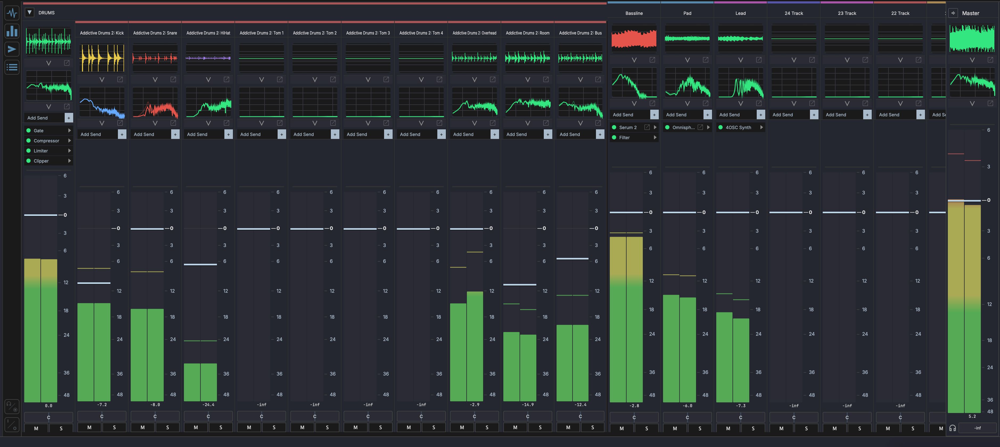

# Mixer View

The Mixer View provides a channel-strip interface for balancing levels, panning, routing, and applying effects. Switch to it by clicking **Mix** in the footer bar.



## Layout

```
┌──────────┬──────────┬──────────┬──────────┬─────────┐
│ Track 1  │ Track 2  │ Track 3  │ Aux 1    │ Master  │
│          │          │          │          │         │
│ [Routing]│ [Routing]│ [Routing]│ [Routing]│         │
│ [Sends]  │ [Sends]  │ [Sends]  │ [Sends]  │         │
│          │          │          │          │         │
│  ┃  ┃    │  ┃  ┃    │  ┃  ┃    │  ┃  ┃    │  ┃  ┃   │
│  ┃██┃    │  ┃█ ┃    │  ┃  ┃    │  ┃█ ┃    │  ┃██┃   │
│  ┃██┃    │  ┃██┃    │  ┃█ ┃    │  ┃██┃    │  ┃██┃   │
│  ┃██┃    │  ┃██┃    │  ┃██┃    │  ┃██┃    │  ┃██┃   │
│  [Pan]   │  [Pan]   │  [Pan]   │  [Pan]   │  [Pan]  │
│  M S R   │  M S R   │  M S R   │  M S     │         │
│ Track 1  │ Track 2  │ Track 3  │ Aux 1    │ Master  │
└──────────┴──────────┴──────────┴──────────┴─────────┘
```

- **Channel strips** — One per track, scrollable horizontally
- **Aux channel strips** — Auxiliary/bus tracks
- **Master channel strip** — Final output, fixed on the right
- **Resizable width** — Drag the edge of a channel strip to resize

Click a channel strip to select it. Drag plugins onto a channel strip to add them to the track's FX chain.

## Toggle Rail

A vertical rail of toggles runs down the left edge of the mixer. Each button shows or hides a row across every channel strip, so you can pare the mixer back to just the controls you need:

- **Sends** — the send section
- **I/O** — input and output routing selectors
- **Monitor** — input monitoring controls
- **Oscilloscope** — a mini oscilloscope per strip
- **Spectrum** — a mini spectrum analyzer per strip
- **FX Chain** — the strip's mini FX chain

The rail's on/off state is remembered between sessions. Below the toggles sits the **Analyze** button — see [Mix Analysis](#mix-analysis).

## Channel Strip Controls

Each channel strip provides:

### Volume Fader

Drag the fader to adjust the track's output level. The fader sits over the track's peak meter, with the current level shown as a dB readout below the thumb.

### Level Meters

The peak meter sits directly behind the fader and shows the real-time signal level. A peak value displays the highest level reached — watch for clipping. Click the peak readout to reset it.

### Pan

The pan control positions the track in the stereo field, from hard left to hard right.

### Mute, Solo, Record

- **Mute** (M) — Silence the track output
- **Solo** (S) — Solo this track, muting all others
- **Record** (R) — Arm the track for recording
- **Monitor** — Enable input monitoring

### Track Name and Color

The track name and color bar are displayed at the bottom of each strip for identification.

### Mini FX Chain

With the **FX Chain** toggle on, each strip shows a compact version of the track's FX chain. Each device row surfaces a handful of its parameters as faders, so you can tweak an effect without leaving the mixer. Choose exactly which parameters appear per device from the **Mini** column in the [parameter config dialog](plugin-parameters.md) — if none are chosen, the strip falls back to the device's first visible parameters. Third-party plugins also show a button to open their own UI; native MAGDA devices do not.

### Mini Analyzers

With the **Oscilloscope** or **Spectrum** toggle on, a mini [analyzer](devices/analysis.md) appears on each strip that carries the matching device. Click the expand chevron to unfold its controls beneath the trace, or the pop-out button to open the full analyzer in its own floating window.

## Master Channel Strip

The master strip controls the final output level of the mix. It has its own volume fader, meters, and pan control but no mute/solo/record buttons.

## Mix Analysis

The **Analyze** button at the bottom of the toggle rail runs a measured analysis of the mix and shows the findings in a small panel anchored to the button.

- **Scope** — with no channels selected, the whole mix is analysed; select channel strips first to scope the measurement to just those tracks. The panel title shows the scope and the range (the loop region if one is active, otherwise the whole song).
- **Findings** — a per-track table of measured values (integrated loudness, peak, peak-to-loudness ratio, stereo correlation and width, with a row for the master) followed by any detected **collisions**: frequency ranges where two tracks mask each other, with a severity rating.
- **Re-run** the analysis after changes, or **Stop** a run in progress.

The same measurements feed the [mixing agent](panels/ai-assistant.md#mixing-agent): once an analysis exists, the AI console in the mixer view picks it up as context, so you can ask for mix feedback grounded in real numbers rather than guesswork.

## I/O Routing

Each channel strip has routing selectors for:

- **Audio input** — Select which physical input or bus feeds the track
- **Audio output** — Choose where the track's audio is sent (master, aux bus, etc.)
- **MIDI input** — Select the MIDI input device and channel
- **MIDI output** — Route MIDI to a specific device or virtual instrument

## Sends

Each channel strip has a send section for routing audio to auxiliary buses. Show or hide it with the **Sends** toggle in the rail.

- **Add a send** — Create a new send slot to route signal to an aux track
- **Send level** — Adjust how much signal is sent to the aux bus
- **Remove a send** — Click the remove button on a send slot to delete it

The send section sizes itself to the number of sends across your tracks, so every strip stays aligned.

## Multi-Output Plugins

When an instrument has multiple output pairs activated, each output appears as its own channel strip in the mixer — just like any other track. You can route these strips to groups or aux sends independently. See [Multi-Output Plugins](tracks.md#multi-output-plugins) for setup details.

The device's multi-out menu lets you toggle several pairs in one go: the menu stays open as you tick pairs, and **Activate All** / **Deactivate All** bring every output in or out with one click.

## DrumGrid Sub-Channels

When a track contains a DrumGrid device with multiple outputs, the mixer can expand to show individual sub-channel strips for each drum voice, giving you independent level and pan control per pad output. See [Drum Grid](devices/drum-grid.md) for details.
