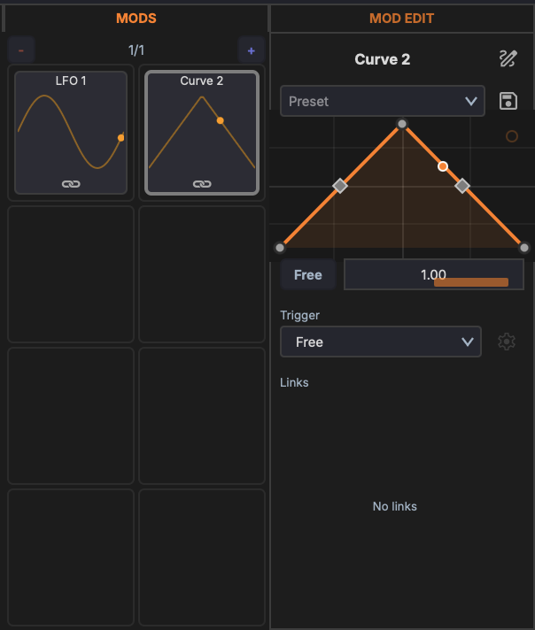

# Linking Parameters

Linking connects modulation sources (modulators or macros) to target parameters on devices.

## Link Mode

Link mode is the workflow for creating modulation connections:

1. **Enter link mode** — Click the link button in the toolbar or press the link mode shortcut
2. **Select a source** — Click a modulator or macro knob
3. **Click a target** — Click any device parameter knob or slider
4. **Adjust the link** — Set the modulation amount and polarity
5. **Exit link mode** — Press ++escape++ or click the link button again

## Drag and Drop

You can also create links by dragging from a modulation source directly onto a target parameter. This is a shortcut that skips the link-mode workflow.

## Link Settings

Each link has the following properties:

- **Amount** — How much the source affects the target (0–100%)
- **Bipolar** — When enabled, modulation swings both above and below the parameter's current value. When disabled, modulation only adds to the current value.

## Modulation Matrix

The modulation matrix provides an overview of all active links on a track:

- **Rows** represent sources (modulators and macros)
- **Columns** represent target parameters
- **Cells** show the link amount — click to edit or remove

## Visual Indicators

When modulation is active:

- **Animated rings** appear around modulated parameter knobs, showing the modulation range in real time
- **Color coding** distinguishes between different modulation sources
- Parameters with active modulation links display a small indicator dot

## Linking Modulator-to-Modulator

Modulators can target each other's **Rate** to create more interesting motion than a single LFO can produce on its own. A slow LFO modulating a faster LFO's rate gives you accelerating-then-decelerating wobbles; a square-wave LFO driving another LFO's rate gives you discrete tempo shifts.

To create the link:

1. Open the modulator editor for the source LFO.
2. Right-click the destination LFO's Rate slider, or use link mode with the source LFO selected.
3. Adjust the modulation amount as usual.

A modulator's Rate can be driven by **modulators and macros from the same scope** (track, rack, or device). Cross-scope links — say, a track-level macro driving a Rate inside a nested rack — are not supported in 0.6.0.

## Same-Scope Rule

Macro→param, macro→mod, mod→param, and mod→mod links must all stay within the same scope. The scope is the parent that owns the source: track-level macros target track-level mods or any device on the track; rack-level macros target rack-level mods or devices in that rack; device-level macros and mods target only that device.
