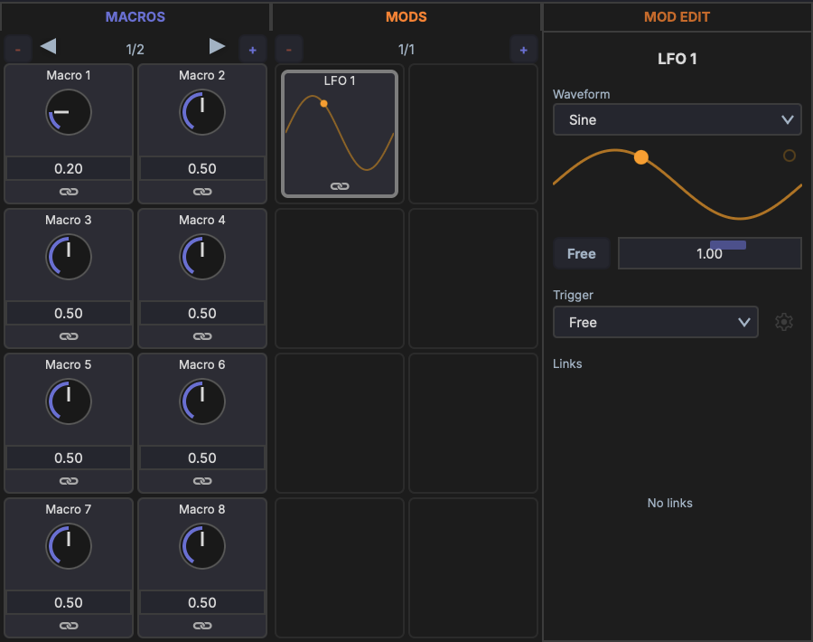

# Macros

Macros are user-defined control knobs that provide quick, unified access to multiple device parameters.

## Layout

Each track has **16 macro knobs** organized across **2 pages** (8 knobs per page). Macros are visible in the track's device chain and in the Inspector when the track is selected.

## Range

All macro knobs output a normalized **0–1 range**. The mapping to each target parameter's actual range is handled by the modulation link (see [Linking Parameters](linking.md)).

## Naming

- Double-click a macro's name label to rename it (e.g., "Filter Cutoff", "Drive Amount"). A single click opens the macro editor instead.
- You can rename from either the name label on the knob or the header of the macro editor panel.
- Names are displayed on the knob and in the modulation matrix

## Assigning Parameters

To connect a macro to a parameter:

1. Enter link mode (see [Linking Parameters](linking.md))
2. Select the macro as the modulation source
3. Click the target parameter
4. Adjust the modulation amount and polarity

A single macro can control multiple parameters simultaneously — for example, one "Brightness" knob could increase filter cutoff, reduce reverb wet, and boost high-shelf EQ gain at the same time.

## Driving Modulators

A macro can also target a modulator's **Rate** instead of a device parameter — turn the macro and you turn the LFO speed. Same workflow:

1. Right-click the macro and pick the modulator from **Link to Parameter… → Modulators**, or
2. Use link mode and click the modulator's Rate slider as the target.

In the screenshot, **Macro 1** at 0.20 is dialling **LFO 1**'s Rate down. As the macro turns, the LFO speed follows. Combine with traditional parameter links and a single knob can sweep filter cutoff, reduce reverb send, *and* slow the LFO that's wobbling the pitch — all at once.

## Use Cases

- Map the most important synth parameters to a few knobs for live performance
- Create unified controls that coordinate multiple effects at once
- Expose simple controls for complex multi-device setups
- Use a macro as a "tempo" or "intensity" control that drives an LFO's rate alongside the parameters it modulates
