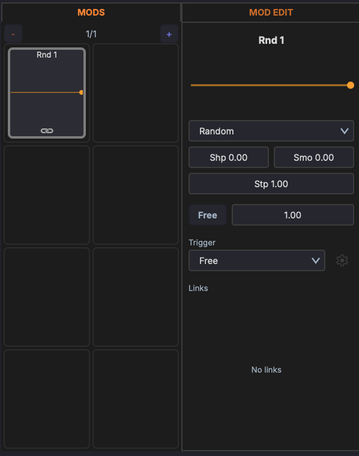
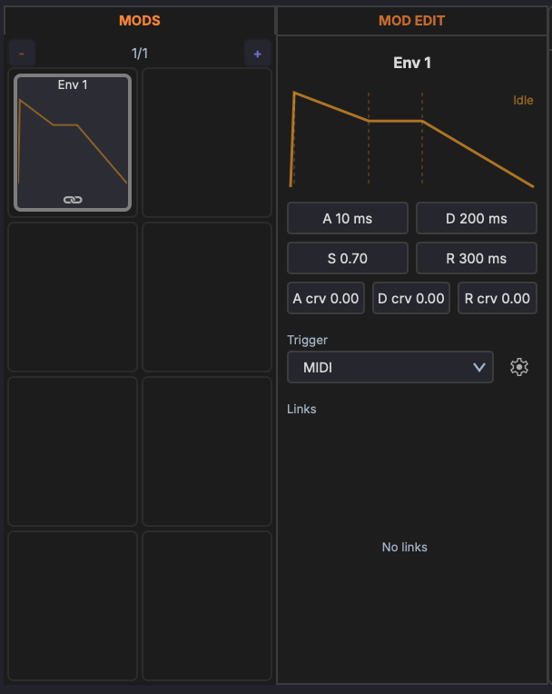
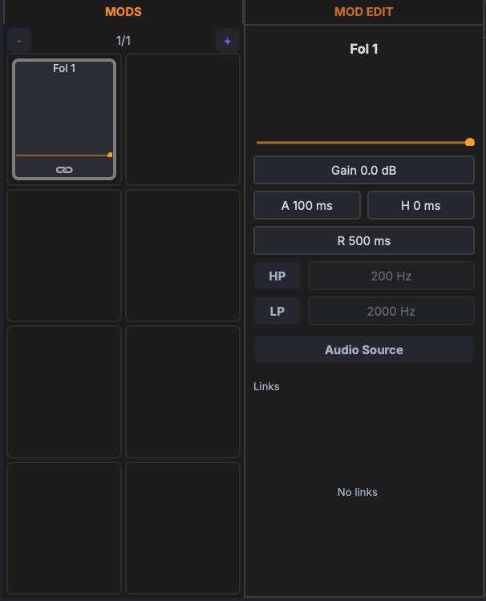

# Modulators

Modulators are signal generators that modulate device parameters over time. Each track has a global modulator panel that can target any parameter on any device in the track's chain.

Modulators are managed from the modulation panel at the bottom of the track chain. Click the **+** button to add a new modulator. The panel shows active modulators alongside the macro knobs.

Double-click a modulator's name label to rename it (for example "Filter Wobble" or "Swell"), the same way you rename a [macro](macros.md#naming). Custom names make a track with several LFOs and envelopes far easier to read.

{ width="500" }

## LFO

A low-frequency oscillator that cycles through a waveform shape.

### Waveforms

- Sine
- Triangle
- Sawtooth
- Square
- Random (Sample & Hold)

### Parameters

- **Rate** — Speed of the LFO cycle (Hz or synced to tempo)
- **Depth** — Modulation amount
- **Phase offset** — Starting point in the waveform cycle (0°–360°)
- **Tempo sync** — Lock the rate to musical divisions (1/4, 1/8, 1/16, etc.)
- **One-shot** — Play the waveform once instead of looping

## Bezier Curve Shape

A freely editable modulation shape drawn with bezier curves. Use this to create complex, custom modulation patterns that go beyond standard waveforms.

### Editing

- **Add a point** — Double-click on the curve
- **Move a point** — Drag it to a new position
- **Adjust curvature** — Drag the bezier handles to shape the curve between points
- **Delete a point** — Double-click an existing point

### Parameters

- **Rate** — Speed of the curve cycle (Hz or synced to tempo)
- **Depth** — Modulation amount
- **Tempo sync** — Lock the rate to musical divisions

## Random

A randomised modulation source. Unlike the LFO's Sample & Hold waveform, the Random modulator has its own shaping and smoothing controls and can run as stepped random values or continuous noise. The slider at the top sets the output amount.

### Type

The dropdown selects the source:

- **Random** — Generates a new random value each cycle (sample & hold)
- **Noise** — Continuous random signal

### Parameters

- **Shp** (Shape) — Biases the distribution of the random values
- **Smo** (Smooth) — Smooths the transitions between values (0 = hard steps, 1 = gliding)
- **Stp** (Step Depth) — Amount of stepped variation between values
- **Rate** — The row below sets the speed. The **Free** button toggles between free-run (rate in Hz) and tempo-synced (a musical division such as 1 Bar, 1/4, 1/8). The field beside it sets the value.
- **Trigger** — How the modulator is (re)started: **Free**, **Transport**, or **MIDI**.

## Envelope (ADSR)

An ADSR envelope used as a modulation source. Triggered by playback or incoming MIDI notes, it shapes a parameter through attack, decay, sustain, and release stages. The display at the top shows the envelope shape and its current state (for example *Idle*).

### Parameters

- **A** (Attack) — Rise time to peak (ms)
- **D** (Decay) — Fall time to the sustain level (ms)
- **S** (Sustain) — Held level while gated (0–1)
- **R** (Release) — Fall time after the gate releases (ms)
- **A crv / D crv / R crv** — Bend each stage from logarithmic to exponential
- **Trigger** — What starts the envelope: **Free** (cycles continuously), **Transport** (starts on play), or **MIDI** (gated by note on/off). The gear button beside it holds tempo-sync options for the stage times.

## Envelope Follower

Follows the amplitude of an audio signal and uses it as a modulation source. Use it to make one parameter react to the dynamics of a track, for example ducking a pad from a kick drum. The bar at the top shows the live follower output.

### Audio source

Click the **Audio Source** button to choose what the follower listens to — the track's own audio, or another track's audio routed in as a sidechain.

### Parameters

- **Gain** — Input gain into the detector (dB)
- **A** (Attack) — How fast the follower rises (ms)
- **H** (Hold) — Time held at the peak before releasing (ms)
- **R** (Release) — How fast the follower falls (ms)

### Detection filters

Band-limit what the follower reacts to so it tracks only part of the spectrum:

- **HP** — Toggle on and set the cutoff (Hz) to ignore low frequencies
- **LP** — Toggle on and set the cutoff (Hz) to ignore high frequencies
