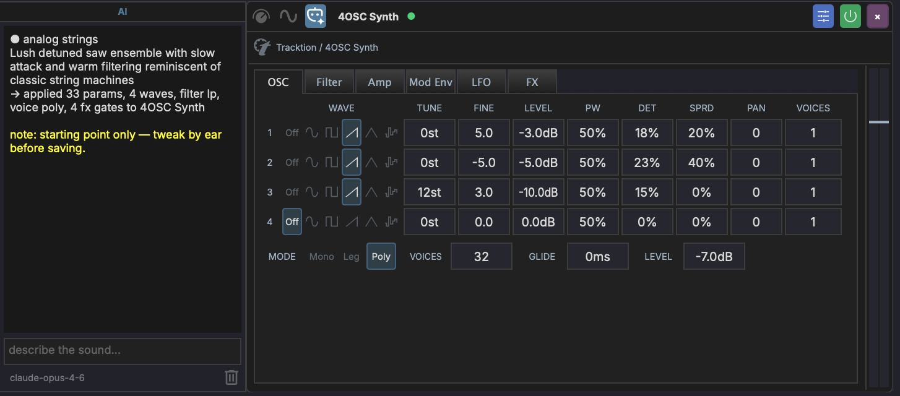

# AI Assistant

MAGDA includes a built-in AI chat assistant that lets you control the DAW using natural language, and a DSL console for direct scripting.

{ width="400" }

## Overview

The AI Assistant panel is located in the left panel. It has two tabs at the bottom: **AI** for natural-language interaction and **DSL** for direct script execution.

## AI Tab

Type a request in natural language and the assistant translates it into actions:

- "Add a MIDI track with a bass clip"
- "Transpose the selected notes up an octave"
- "Set the tempo to 120 BPM"
- "Mute tracks 3 and 4"

The assistant is **context-aware** — it knows which tracks, clips, and devices exist in your project and what is currently selected.

### Selection Context

At the bottom of the AI panel, a context indicator shows the currently-selected track, clip, or device.

- When the indicator is **on** (orange accent colour), the AI treats your selection as the default target. A request like "add a bassline" with a track selected will target that track instead of creating a new one.
- Click the indicator to **toggle it off**. The selection is no longer sent to the LLM, and requests are interpreted without a default target.

Creating a new track still works either way — just be explicit in the request ("new track", "another track") when the indicator is on.

### How It Works

1. You type a natural-language request in the chat
2. The assistant translates your request into MAGDA's internal DSL (domain-specific language)
3. The DSL commands are executed as actions in the project
4. The assistant confirms what was done

### Setup

The AI Assistant supports both cloud LLM providers and a fully offline local model. Configure them in the **AI Settings** dialog (**Settings > AI Settings**); see [AI Settings](../interface/ai-settings.md) for the Cloud, Local, and Config tabs.

### Usage Tips

- Be specific: "Add a reverb to Track 2" works better than "make it sound spacey"
- The assistant can handle multi-step requests: "Create 4 MIDI tracks and name them Kick, Snare, HiHat, Bass"
- Use it for repetitive tasks: "Set all tracks to -6 dB"
- Prefix a message with `/dsl` to execute DSL directly from the AI chat without making an AI call

## Drummer Agent

When you select a track that hosts a [Drum Grid](../devices/drum-grid.md) (or a MIDI clip on one), the AI chat automatically switches into **Drummer** mode. The input area shows a drum icon and a `Drummer - <track name>` breadcrumb, and your requests are routed to a specialised agent that writes drum patterns instead of the general DAW assistant.

In this mode, describe the groove you want in plain language:

- "four on the floor with offbeat open hats"
- "a half-time hip-hop beat, snare on 3"
- "busier hats in the second bar"

The agent works in terms of drum **roles** (kick, snare, closed hat, and so on), so it places hits on the pads you have labelled with matching [roles](drum-grid-editor.md#row-labels-and-roles). If a Drum Grid clip is selected, its current pattern is sent along as context, so follow-up requests like "add a crash on the downbeat" build on what is already there. The generated pattern is written straight into the selected clip.

Drummer mode is automatic and context-driven; there is no slash command to type. Select a non-drum track to return to the general assistant.

## View Context

The console follows the view you are working in. The context label above the input box shows where your requests are routed:

- **Arrangement view** — requests go through the general assistant, which picks the right specialised agent for the task.
- **Session view** — requests are scoped to session workflows (scenes, clip slots, launching).
- **Mixer and master views** — requests are routed to the **mixing agent**.

Each view keeps its own conversation, so switching between Arrangement, Session, and Mixer picks up the thread you left in that view rather than mixing them together.

## Mixing Agent

In the mixer view, the console talks to a specialised mixing agent. It can read the per-track measurement layer — loudness, peaks, stereo width and correlation, and detected frequency collisions between tracks — and ground its feedback in those numbers.

Run an analysis from the mixer's [Analyze button](../mixer-view.md#mix-analysis) first; a **mix analysis ready** chip appears next to the console input once results exist. Then ask things like:

- "what is fighting with the bass?"
- "is the master loud enough for streaming?"
- "which tracks are mono-incompatible?"

The agent reads the measured findings rather than guessing from track names, and can suggest concrete moves (level trims, EQ areas to look at) based on them.

## DSL Tab

{ width="300" }

The DSL tab provides a code editor with **syntax highlighting** for the MAGDA DSL. It's designed for users who want to script DAW operations directly without going through the AI.

### Editor Features

- **Syntax highlighting** — keywords (blue), methods (yellow), parameters (light blue), strings (orange), numbers (green), note names (teal), comments (green)
- **Direct execution** — commands run immediately against the DAW with no network calls
- **Command history** — results appear in the output area above the editor
- **Keyboard shortcuts**:

| Shortcut | Action |
|----------|--------|
| ++cmd+enter++ (Mac) / ++ctrl+enter++ (Win) | Execute code |
| ++cmd+l++ (Mac) / ++ctrl+l++ (Win) | Clear output |

### Quick Start

Switch to the DSL tab, type a command, and press ++cmd+enter++:

```
track(name="Bass", new=true).clip.new(bar=1, length_bars=4)
```

Type `help` and execute to see available commands.

## DSL Quick Reference

A few common commands to get started. For the full language reference, see **[DSL Reference](../reference/dsl.md)**.

```
track(name="Bass", new=true).clip.new(bar=1, length_bars=4)
  .notes.add_chord(root=C4, quality=major, beat=0, length=4)
  .notes.add(pitch=E2, beat=0, length=1, velocity=100)
track(name="Bass").fx.add(name="compressor")
track(name="Bass").track.set(volume_db=-6)
groove.set(template="Basic 8th Swing", strength=0.5)
```

### Slash Commands

Prefix your message with a slash command to constrain the AI to a specific domain:

| Command | Description |
|---------|-------------|
| `/groove <request>` | Create or apply swing/groove timing templates |
| `/design <description>` | Generate a 4OSC preset from a natural-language description and apply it to the focused 4OSC device |

Typing `/` shows an autocomplete popup with available commands.

#### `/design` — AI Sound Design

Select a 4OSC device, then type `/design <description>`. The assistant produces a preset (waves, filter type, voice mode, FX gates, ADSR, levels) and applies it directly to the focused device.

The chat shows a categorised summary of what changed, plus a one-line apply status. The preset name and category the AI chose become the default values when you save the preset from the device header — just click save and hit Enter.

Built-in safeguards:

- A **master-level safety cap** estimates worst-case peak gain from the active oscillator count, distortion drive, and filter resonance, then clamps the master `level` to keep peaks in a sensible range. The AI's choices are only overridden when they would clip.
- The result is a **starting point**, not a final preset. Tweak by ear before saving.

For example prompts and recipes, see the [4OSC Synth — AI Sound Design](../devices/4osc.md#ai-sound-design-design) section.

## Per-Device AI Panel

Sound-design generation is also available without leaving the device chain. Every device slot exposes an **AI** icon in its header — click it to open a docked panel attached to that device.



The panel has three rows:

- **Output area** — streams the model's response token-by-token, then appends a one-line apply status (`→ applied N params, M waves, …`). The history persists across slot rebuilds (preset loads, plugin reloads, sidechain edits) — your last result stays put until you clear it.
- **Prompt input** — type a description and press ++enter++ to submit. Submitting cancels any in-flight generation on the same device.
- **Footer** — shows the active model id on the left and a delete button on the right. The delete button clears the chat for that device only.

Generations are scoped to the device the panel is mounted on. Devices without a sound-design agent (everything except 4OSC at the moment) show **AI design not supported for this device** in place of the prompt placeholder.

This is the same engine as the chat-based `/design` command — same agent, same safeguards, same preset name/category propagation to the save dialog. The panel is just a more direct path: focus the synth, prompt it, hear it.

## Param Aliases (`@`)

The AI chat understands **`@aliases`** as a shorthand for paths. Type `@` in the chat input to open an autocomplete list of available aliases — focused track, focused device, named macros, named modulators. Picking one expands to the full path the AI agent resolves.

Useful for tying a request to a specific scope without spelling the path out:

```
@focused.macro = 0.7
modulate @focused.cutoff with a slow LFO
```

Aliases are resolved server-side to the same `ChainNodePath` the DSL uses, so any command that takes a path takes an alias.
