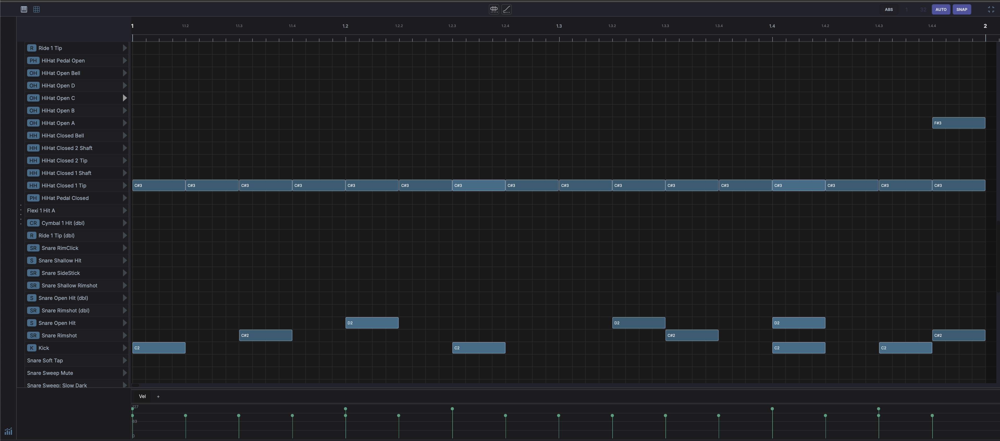

# Drum Grid Editor

Displayed in the bottom panel when a drum clip is selected or a DrumGrid device is active. Shows a step-sequencer-style grid:

- **Rows** represent drum pads / MIDI notes
- **Columns** represent time steps
- **Click** cells to toggle hits on/off
- **Velocity** per hit is adjustable
- **Live input highlight** — with the track's input monitoring on, pad rows light up as you play them and the played row scrolls into view

!!! note "Header controls"
    - **Grid resolution** — Draggable numerator/denominator for grid subdivision
    - **AUTO** — Automatically adjust grid resolution based on zoom level
    - **SNAP** — Toggle snap-to-grid
    - **Slice** — Split each selected note into equal pieces (see [Slicing Notes](piano-roll.md#slicing-notes))
    - **Time Bend** — Redistribute selected note timing along a curve (see [Time Bend](../time-bend.md#drum-grid-editor))
    - **Fullscreen** — Pinned to the far right, this toggle expands the editor to fill the window. Click again to restore. Shared with the Piano Roll.

!!! note "Footer controls"
    - { width="16" } **Velocity** — Toggle the velocity lane at the bottom of the editor

## Row Labels and Roles

Each pad row can carry a custom name and an instrument **role**. The role is a semantic label (what the pad *is*: a kick, a snare, a closed hat) and shows as a small coloured pill next to the row, abbreviated to a short tag like `K`, `S`, or `HH`.

Right-click a row to set both:

- **Set instrument** - choose a role from the submenu, or **None** to clear it.
- **Rename label...** - give the row a custom name.
- **Clear label** - remove the custom name.
- **Clear role** - remove the role (leaving the pad unlabelled).

Roles are also what the [Drummer agent](ai-assistant.md#drummer-agent) reads and writes, so labelling your pads lets the AI place hits on the right voices.

The available roles and their short tags:

| Role | Tag | Role | Tag |
|------|-----|------|-----|
| Kick | K | Ride | R |
| Snare | S | Ride Bell | RB |
| Snare Rim | SR | Crash | CR |
| Clap | C | Tom High | TH |
| Closed Hat | HH | Tom Mid | TM |
| Open Hat | OH | Tom Low | TL |
| Pedal Hat | PH | Perc 1-4 | P1-P4 |

## Drumkits

A **drumkit** saves a grid's row layout - each pad's note, custom label, and role - so you can reuse it across projects. Right-click a row to manage kits:

- **Save as drumkit...** - name and save the current grid's row layout.
- **Apply template** - apply a built-in template or one of your saved drumkits to the current grid.

Drumkits store pad metadata (notes, labels, roles), not the samples themselves.

See [Drum Grid](../devices/drum-grid.md) for the DrumGrid device itself, including per-pad sample loading, FX chains, and envelopes.
