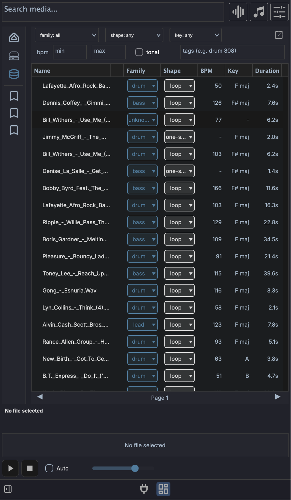

# Media Library

The **Media Library** is the searchable, indexed side of the left browser panel. Where the [Media Explorer](browsers.md#media-explorer) walks your filesystem folder by folder, the Library lets you index folders once and then find sounds by family, shape, key, tempo, tags, or a plain-language description of what you want.

## Disk and Library modes

The left panel sidebar has two buttons that switch what the browser shows:

- **Disk** - the filesystem browser (Media Explorer). Navigate folders and preview files as they sit on disk.
- **Library** - the indexed sample database. Searches and filters run against everything you have indexed, regardless of which folder it lives in.

You index folders from **Disk** mode and then search them from **Library** mode.

## Indexing folders

The Library is empty until you index something. In **Disk** mode, right-click any folder:

- **Index this folder** - shown when nothing under the folder has been indexed yet. Scans the folder and adds every supported file.
- **Scan for new files** - skips files already in the database and only processes ones it has not seen.
- **Re-index this folder** - re-derives every file from scratch, ignoring the cache. Use this after a tagging-model change or if entries look wrong.
- **Change folder location...** - point an indexed folder at a new path on disk without losing its entries.
- **Remove from media library** - drops the folder's entries from the database. The files on disk are untouched.

!!! warning "Always move indexed folders with Change folder location..."
    If you move or rename an indexed folder in Finder, Explorer, or your file manager, every entry under it points at a path that no longer exists and the rows are flagged **missing**. Use **Change folder location...** to relocate an indexed folder so the database follows the move and your entries stay intact. If a folder has already been moved by hand, you can recover it: re-index it at the new path, or fix individual files with **Recover missing file...**.

!!! note "Indexing is manual"
    There is no scan-on-startup or live filesystem watcher. The Library only changes when you index, re-index, or scan for new files. When files on disk change after indexing, their rows are flagged (see [Row status](#row-status)) so you know to re-scan.

### The Index Folder dialog

When you start indexing, the **Index Folder** dialog lets you attach tags to every row in that scan:

- **Tags** - free-text tags applied to all files in the folder (for example a pack name).
- **Use folder name** - adds the folder's own name as a tag (on by default).
- **Use subfolder names** - adds each subfolder along the path as a tag (off by default).

Press **Start** to begin. Indexing runs in the background; you can keep working while it scans.

### What gets indexed

| Kind | Extensions | Analysis |
|------|-----------|----------|
| Audio | `.wav`, `.aif`, `.aiff`, `.mp3`, `.flac`, `.ogg` | Full: BPM, key, family, shape, duration, tags |
| Presets | `.vstpreset`, `.aupreset`, `.mps` | Path, format, and parsed metadata only |

For audio, MAGDA derives what it can from the file itself (tempo, key, duration, whether the sound is tonal) and from naming conventions in the path (a `kick_120bpm.wav` in a `.../Drums/Kicks/` folder picks up the tempo and a `drum` family hint).

## Searching and filtering

In **Library** mode the search bar and filter strip drive the results table.

- **Search media...** (top bar) - a plain-language semantic search. Type a description like `warm analog bass` and press ++enter++ to rank results by how close their sound is to your text. This uses the [AI Sample Analyzer](#ai-sample-analyzer) and runs on ++enter++ rather than per keystroke. Clearing the box restores the unfiltered view.
- **File-type icons** (top bar) - the audio / MIDI / preset icons double as the kind filter in Library mode, narrowing results to a file type.

The filter strip below adds structured filters that combine with the search:

- **family** - a closed set: `drum`, `bass`, `lead`, `pad`, `keys`, `guitar`, `orchestral`, `vocal`, `fx`, `texture`.
- **shape** - `one-shot`, `loop`, or `sustained`.
- **key** - root note from `C` to `B`.
- **BPM** - `min` and `max` boxes for a tempo range.
- **tonal** - toggle to limit results to pitched (tonal) material.
- **tags** - free-text keyword filter. Space- or comma-separated tokens are AND-combined against each row's tags (for example `drum 808`). This works whether or not the Sample Analyzer is installed.

Results are paginated at 100 rows per page; use the **Prev** / **Next** buttons at the bottom to move between pages.

### Results columns

The table shows **Name**, **Family**, **Shape**, **BPM**, **Key**, **Duration**, and **Tags**. Drag column headers to reorder them, and use the header's right-click menu to toggle column visibility. The **Tags** column is hidden by default in the docked panel and shown by default in the [pop-out window](#pop-out-window).

The **Family** and **Shape** cells are clickable pills: click one to reassign a row's family or shape from a menu, without opening the full edit dialog.

### Row status

Each row carries an integrity badge:

- **ok** - the file on disk matches what was indexed.
- **dirty** - the file changed (modified time or size) since it was indexed. Re-scan to refresh it.
- **missing** - the file is no longer at its indexed path. Use **Recover missing file...** to point the row at its new location.

## Editing entries

Right-click a row (or a multi-row selection) for per-row actions:

- **Edit row fields and tags...** - edit the family, shape, key, BPM, and tags by hand. With multiple rows selected this becomes **Edit selected row fields and tags...** for bulk edits.
- **Reset to detected** - discard manual edits and re-derive fields from the file itself.
- **Save current clip values to library** - if the file is open as a clip in the project, write that clip's BPM, key, and related values back to the Library row.
- **Recover missing file...** - browse to the new location of a file flagged **missing**.
- **Find similar sounds to "..."** - find sounds whose audio resembles the selected one (see below).
- **Analyze selected rows** - run the [AI Sample Analyzer](#ai-sample-analyzer) over the selection.
- **Delete selected rows** - remove the rows from the database (the files on disk are untouched).

The table header's right-click menu also offers **Remove duplicate file rows...** to clear out repeated paths.

## AI Sample Analyzer

The Sample Analyzer is an optional AI model that listens to your samples and adds two capabilities:

- **Semantic text search** - the **Search media...** box can rank sounds by a plain-language description instead of relying on filenames and tags.
- **Find similar sounds** - right-click a row to surface other samples that sound like it, ranked by audio similarity.

It is built on CLAP (Contrastive Language-Audio Pre-training), which embeds audio and text into the same space so the two can be compared.

!!! note "Not the CLAP plugin format"
    The CLAP used here is a machine-learning model for matching audio to text. It is unrelated to CLAP the audio plugin standard, which shares the acronym but is a different thing entirely.

### Installing it

The analyzer is a separate download, not bundled with the app. Open the [AI Settings](../interface/ai-settings.md#sample-analyzer) dialog (**Settings > AI Settings**) and pick the **Sample Analyzer** tab, where it shows the download size and a **Download Sample Analyzer** button. Once installed, **Load** brings the models into memory (they also preload in the background the first time you enter Library mode).

The **Sample Analyzer** icon (a database icon) in the [footer status bar](../interface/overview.md#footer) shows the current state. Its colour reflects the state and the tooltip names it: **not installed**, **installed** (downloaded but not loaded), **loading**, or **loaded**.

### Without the analyzer

Indexing and the Library still work without it; you simply lose semantic search and find-similar. Filename, tag, family, shape, key, and BPM filtering all work on their own. When you index a folder without the analyzer installed, MAGDA warns you and lets you continue. You can install the analyzer later and run **Analyze selected rows** to backfill the audio analysis on rows that were indexed without it.

## Adding sounds to your project

Drag rows from the Library into the project exactly as you would from the Media Explorer. Drop targets behave the same way:

- [Arrangement View](../arrangement-view.md#multi-sample-drag-and-drop) - an empty area creates one track per sample; an existing track appends clips sequentially.
- [Session View](../session-view.md#multi-sample-drag-and-drop) - an empty area stacks samples into scene rows; an existing track fills consecutive scene slots.
- [Drum Grid](../devices/drum-grid.md#multi-sample-drop) - samples fill consecutive pads from the drop target.

Select multiple rows (++shift++-click for a range, ++cmd++-click / ++ctrl++-click to toggle individual rows) and drag any one of them to drag the whole selection.

!!! note "Linux drag-and-drop"
    On macOS and Windows, dragging out of the Library is an OS-level drag, so you can also drop files into Finder, Explorer, or a plugin's file slot. On Linux the drag is internal to MAGDA, so it targets in-app destinations such as tracks and the Drum Grid.

## Pop-out window

The **Open in window** button (top of the filter strip) detaches the Library into its own resizable window, which is useful when you want a tall results list alongside the arrangement. The pop-out shows the **Tags** column by default.

## Managing the database

The database is a rebuildable cache; your audio files on disk remain the source of truth. Its settings live in the **Media Database** section of [Preferences](../interface/preferences.md):

- **Database location** - **Browse...** to move the database file, or **Reset** to return it to the default location.
- A statistics line showing how many entries are indexed.
- **Wipe database...** - clear every indexed entry and start fresh. This does not delete any files on disk.
