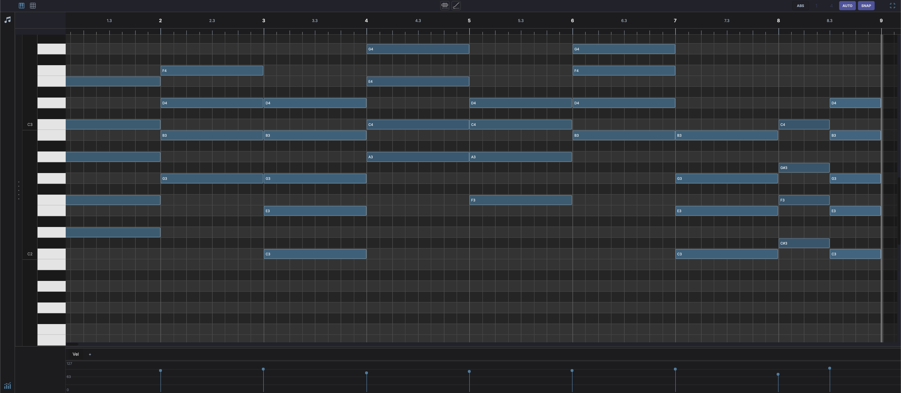

# Piano Roll

Displayed in the bottom panel when a MIDI clip is selected. Provides a grid for editing notes:

- **Horizontal axis** — Time (bars and beats)
- **Vertical axis** — Pitch (MIDI note numbers, with piano keyboard on the left)
- **Vertical zoom** — Drag the zoom strip on the far-left edge (beside the octave labels and keyboard) up or down to change the note row height. The zoom level is remembered per clip.
- **Double-click** an empty cell to add a default-length note at that position and pitch
- ++shift++ **+ drag** on empty grid to draw a note of variable length. The drag distance sets the note length. Acts as a pencil tool.
- **Drag** a note to move it in time or pitch
- **Drag edges** to resize note length
- ++cmd++ **+ click** a note to delete it directly. If the note is part of a multi-selection, the whole group is erased. Acts as a rubber tool.
- **Velocity lane** at the bottom for editing note velocities
- **Live input highlight** — with the track's input monitoring on, the keyboard lights up notes as you play them (MIDI or computer keyboard) and scrolls a held note into view

!!! note "Header controls"
    - **Grid resolution** — Draggable numerator/denominator for grid subdivision
    - **AUTO** — Automatically adjust grid resolution based on zoom level
    - **SNAP** — Toggle snap-to-grid
    - **Slice** — Split each selected note into equal pieces (see [Slicing Notes](#slicing-notes))
    - **Time Bend** — Redistribute selected note timing along a curve (see [Time Bend](../time-bend.md#piano-roll))
    - **Fullscreen** — Pinned to the far right, this toggle expands the MIDI editor to fill the window. Click again to restore. Available for the Piano Roll and Drum Grid Editor.

!!! note "Footer controls"
    - { width="16" } **Velocity** — Toggle the velocity/MIDI lane at the bottom of the editor

## Slicing Notes

Select one or more notes and click the **Slice** button in the editor header bar. A popup shows how many notes are selected and a **SLICES** control. Set how many equal pieces to divide each selected note into (2 to 32, default 4), then click **Apply** or press ++enter++.

Each selected note is split into that many equal-length pieces end to end, keeping the original pitch and velocity. The slices land on the same track in place of the original notes, and they become the new selection so you can immediately edit or slice them again. The action is undoable (++ctrl+z++ to revert). Click **Cancel** or press ++esc++ to dismiss without changing the clip.

Slicing is available in both the Piano Roll and the [Drum Grid Editor](drum-grid-editor.md). The button stays greyed out until at least one note is selected.

## Chord Timeline

When a [Chord Engine](../devices/chord-engine.md) is present on the track, a **chord row** appears above the note grid showing chord annotations. Chords can be placed by dragging from the Chord Engine's suggestion grid, or auto-detected from existing notes using the refresh button. Annotations are linked to their MIDI notes and update automatically when notes are moved, resized, or deleted. See [Chord Engine — Chord Timeline](../devices/chord-engine.md#chord-timeline) for details.
