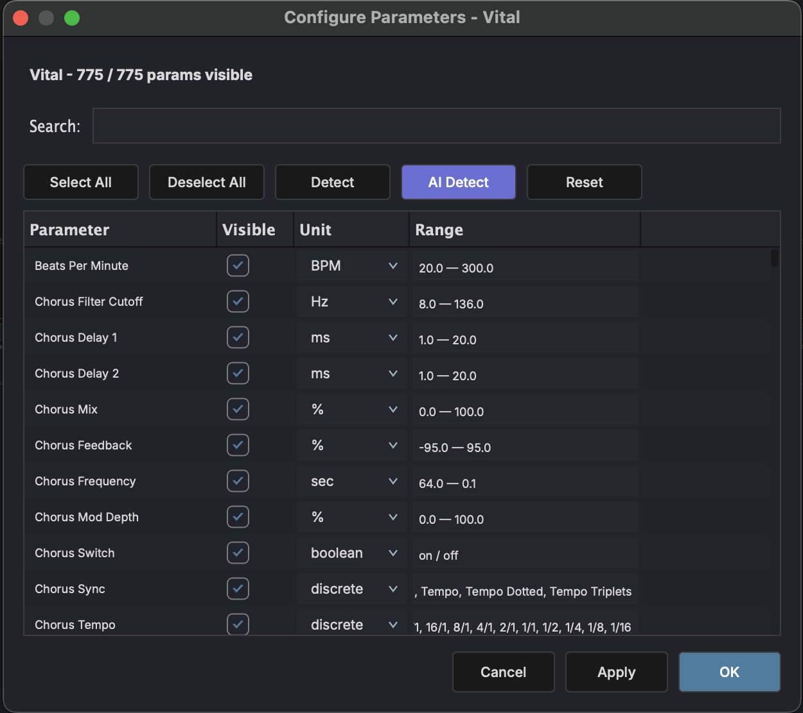
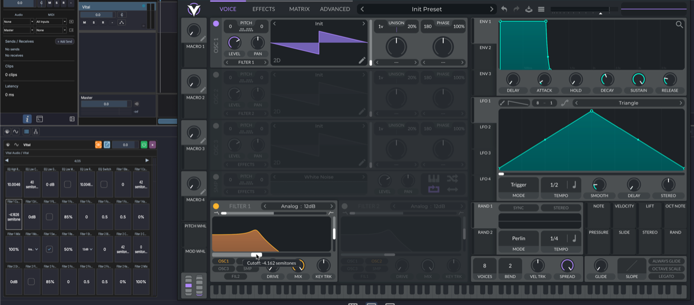

# Plugin Parameters

Third-party plugins rarely tell a host what their parameters actually mean — most expose every knob as a generic 0–100 % value. MAGDA takes a first pass at interpreting those values for you, and the **Parameter Configuration** dialog lets you refine or override the result for any plugin.

The configuration is saved per plugin (by plugin unique ID), so it's applied automatically every time the plugin is loaded.

## Automatic Inference

When a plugin is scanned, MAGDA looks at each parameter's name, value shape, and typical range and guesses a sensible unit and range. Common cases like cutoff frequencies (Hz), envelope times (ms), gain (dB), pitch (semitones), and mix amounts (%) are detected automatically. Parameters it can't classify fall back to a generic 0–100 % display.

You can override or extend the inferred configuration in the dialog described below.

## Configure Parameters Dialog

Open the dialog from the [Plugin Browser](panels/browsers.md#plugin-browser): right-click a plugin and choose **Configure Parameters…**.

The dialog shows one row per parameter with the following columns:

| Column | Description |
|--------|-------------|
| **Name** | Parameter name as reported by the plugin. |
| **Visible** | Toggle whether the parameter shows up in MAGDA's chain, inspector, and AI prompts. Hide parameters you never touch to reduce clutter. |
| **Unit** | Display unit — Hz, dB, ms, %, semitones, or any custom string. |
| **Range** | Minimum, centre, and maximum values in the parameter's own domain. Narrow the range so sliders and AI-generated values stay in the useful zone. |
| **Scale** | Linear, logarithmic, or exponential response curve. |

### Actions

- **Select All / Deselect All** — Toggle visibility across the whole list.
- **Detect** — Run the deterministic heuristic pass (instant, offline). Picks up units and ranges that the plugin's own display strings give away.
- **AI Detect** — Run the heuristic pass and then send anything it couldn't resolve to the configured LLM (see below).
- **Reset** — Discard all inferred units, ranges, and AI-detected values for this plugin and put every parameter back to a plain 0–100 % view.
- **Apply** — Save changes without closing the dialog.
- **OK / Cancel** — Save and close, or discard.

## AI Detect

Typing units and ranges by hand for a plugin with dozens of parameters is tedious. **AI Detect** runs the heuristic pass first, then sends each remaining parameter — name plus a sample of display values — to the configured LLM, which returns a unit, range, and scale.

The results populate the dialog so you can review them before applying — tweak anything you disagree with and hit **Apply**.

!!! note
    AI Detect uses whichever provider is configured in [Preferences > AI](interface/preferences.md). It works with both cloud providers and local inference.

## Learn Mode

Big plugins can have hundreds of parameters spread across many pages in the device slot. Finding the one you want is tedious. Learn mode lets you point at a control in the plugin's own window and have MAGDA jump straight to its slot.

On any plugin device slot in the [FX chain](fx-chain.md):

1. Open the plugin's own window.
2. Click the **Learn** button in the device slot header — it highlights.
3. Touch any control in the plugin's window.
4. MAGDA navigates to the parameter page that contains the matching parameter and highlights its slot.

Click Learn again to exit. Use it to find the right parameter before setting up automation, modulation, or a macro link.

!!! note
    Learn is only enabled while the plugin's own window is open, and is hidden for MAGDA's built-in devices.
