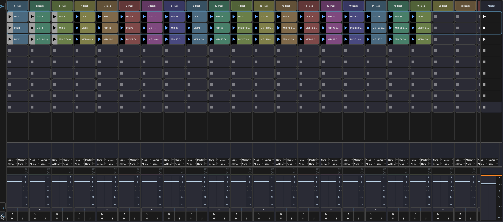

# Session View

The Session View is a grid-based clip launcher for real-time performance and idea sketching. Switch to it by clicking **Live** in the footer bar.



## Layout

The Session View is organized as a grid:

- **Columns** represent tracks
- **Rows** represent scenes
- Each cell is a **clip slot** that can hold an audio or MIDI clip

```
 Track 1    Track 2    Track 3   │ Scene
┌──────────┬──────────┬──────────┼────────┐
│ Clip A   │          │ Clip D   │ ► 1    │
├──────────┼──────────┼──────────┼────────┤
│          │ Clip B   │ Clip E   │ ► 2    │
├──────────┼──────────┼──────────┼────────┤
│ Clip C   │          │          │ ► 3    │
├──────────┼──────────┼──────────┼────────┤
│ Fader    │ Fader    │ Fader    │ ■ Stop │
└──────────┴──────────┴──────────┴────────┘
```

- **Track headers** run across the top — click to select a track
- **Scene launch buttons** on the right trigger all clips in a row simultaneously
- **Stop All** button (■) stops all playing clips
- **Mini mixer** fader row at the bottom provides quick mixing controls

## Clip Slots

Each cell in the grid is a clip slot. A slot can be empty or contain a clip.

- **Click** an occupied slot to trigger (play) the clip
- **Click** a playing slot to stop it
- Only one clip per track plays at a time — triggering a new clip in the same column stops the previous one
- A clip slot has an explicit **play** ▶ and **stop** ■ control on hover for unambiguous launch / stop separate from the clip body click

### Selecting Clips

- **Click** a clip slot to select it
- **++shift++-click** another slot to extend the selection to a rectangular range
- **++cmd++-click** (++ctrl++-click on Windows/Linux) to toggle individual slots in or out of the selection
- Right-click a multi-selection to delete, duplicate, or change properties on every selected clip in one action

### Launch Fade

Each session clip has an optional **launch fade** — a per-clip crossfade applied when the clip launches over the clip it replaces on the same track. Set the fade length in the clip's [Inspector](panels/inspector.md) under the launch section. Useful for pad and atmosphere clips where the hard cut between launches is jarring.

## Scenes

A scene is a horizontal row across all tracks. Launching a scene triggers all clips in that row simultaneously, which is useful for transitioning between song sections during a live performance.

- Click the **scene launch button** (►) on the right side to launch a scene
- Use the **Stop All** button (■) to stop all playing clips at once

## Mini Mixer

At the bottom of the Session View, each track has a mini channel strip for quick mixing without leaving the clip launcher.

Each mini channel strip provides:

- **Volume fader** — Adjust track level
- **Pan knob** — Position in the stereo field
- **Mute** (M) — Silence the track
- **Solo** (S) — Listen to only this track

A **master strip** is also available for the main output level.

The fader row is resizable — drag the top edge to make it taller or shorter.

### Toggle Rail

A toggle rail along the side of the mini mixer shows or hides its rows — I/O routing and sends among them — the same way the [Mixer View](mixer-view.md#toggle-rail) does. Keep the view compact or expand it for more detail.

## Drag and Drop

- Drag audio files from the Media Explorer onto a clip slot to import them
- Drag plugins onto a track header to add effects

### Multi-Sample Drag and Drop

Select multiple samples in the [Media Explorer](panels/browsers.md) (++shift++-click to extend, ++cmd++-click / ++ctrl++-click to toggle) and drag them into the grid:

- **Drop on empty area** — one new track is created per sample, with each clip placed in a separate scene row so the samples stack vertically down the grid.
- **Drop on an existing track** — clips stack down consecutive scene slots on that track, starting from the drop target.

## Adding Clips

- Drag and drop audio or MIDI files from the [Media Explorer](panels/browsers.md) onto an empty clip slot
- Record into the arrangement and move clips to the session grid

!!! note
    Clip launching quantize and follow-action settings are configured in the [Clip Inspector](panels/inspector.md).
